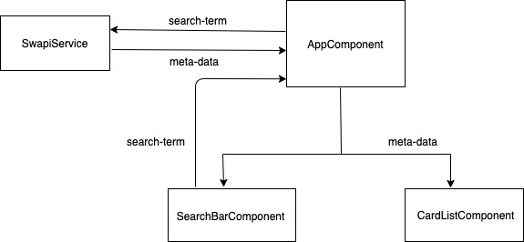

# FlextockTask

## Overview

A web application which would take a string in a form input and search for people using this string input in this public API https://swapi.dev. All retrieved results will be rendered as cards and each card will have the character’s details (Name, URL, height, homeworld). Once rendered the user is able to drag and drop the cards to reorder them on screen.

## Technology stack

- This project was generated with [Angular CLI](https://github.com/angular/angular-cli) version 10.1.6.

- Uses Angular: 10.1.5

- Run on:
    - Node: 12.16.3
    - OS: darwin x64

### Installing Dependencies

#### Installing Node and NPM

This project depends on Nodejs and Node Package Manager (NPM). Before continuing, you must download and install Node (the download includes NPM) from [https://nodejs.com/en/download](https://nodejs.org/en/download/).

#### Installing project dependencies

This project uses NPM to manage software dependencies. NPM Relies on the package.json file located in the `root` directory of this repository. After cloning, open your terminal and run:

```bash
npm install
```


## Development server

Run `ng serve` for a dev server. Navigate to `http://localhost:4200/`. The app will automatically reload if you change any of the source files.

## Architecture

### Angular Component and Service logical flow

An Interaction between the App Components and Service




## API Reference

### Base URL
#### https://swapi.dev/api/

### Endpoints
#### GET '/people/?search=searchTerm' 

- General: this api accepts a query parameter 'search' with a value input by the user 'searchTerm'
- Sample Request:
```
curl https://swapi.dev/api/people/?search=luke
```
- Sample Response:
```$xslt
{
    "count": 1, 
    "next": null, 
    "previous": null, 
    "results": [
        {
            "name": "Luke Skywalker", 
            "height": "172", 
            "mass": "77", 
            "hair_color": "blond", 
            "skin_color": "fair", 
            "eye_color": "blue", 
            "birth_year": "19BBY", 
            "gender": "male", 
            "homeworld": "http://swapi.dev/api/planets/1/", 
            "films": [
                "http://swapi.dev/api/films/1/", 
                "http://swapi.dev/api/films/2/", 
                "http://swapi.dev/api/films/3/", 
                "http://swapi.dev/api/films/6/"
            ], 
            "species": [], 
            "vehicles": [
                "http://swapi.dev/api/vehicles/14/", 
                "http://swapi.dev/api/vehicles/30/"
            ], 
            "starships": [
                "http://swapi.dev/api/starships/12/", 
                "http://swapi.dev/api/starships/22/"
            ], 
            "created": "2014-12-09T13:50:51.644000Z", 
            "edited": "2014-12-20T21:17:56.891000Z", 
            "url": "http://swapi.dev/api/people/1/"
        }
    ]
}
```

## Styling

### Material Design 

According to the Material Design website https://material.io/develop/web, I've used the <a href="material.angular.io">Angular Material Design</a>

### Drag & Drop feature

Drag & Drop using the Angular CDK

reference:
https://www.digitalocean.com/community/tutorials/angular-drag-drop

## Running unit tests

Run `ng test` to execute the unit tests via [Karma](https://karma-runner.github.io).

### Code Coverage

Run `ng test --code-coverage` to get a summary of the tests' code coverage

```
=============================== Coverage summary ===============================
Statements   : 68.75% ( 22/32 )
Branches     : 0% ( 0/4 )
Functions    : 63.64% ( 7/11 )
Lines        : 62.96% ( 17/27 )
================================================================================
```
## Further help

To get more help on the Angular CLI use `ng help` or go check out the [Angular CLI README](https://github.com/angular/angular-cli/blob/master/README.md).
